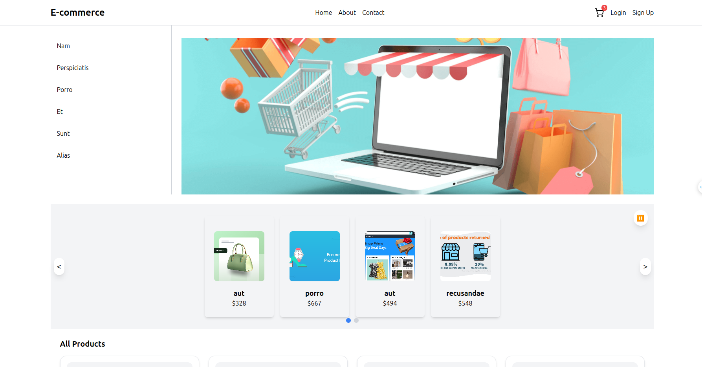
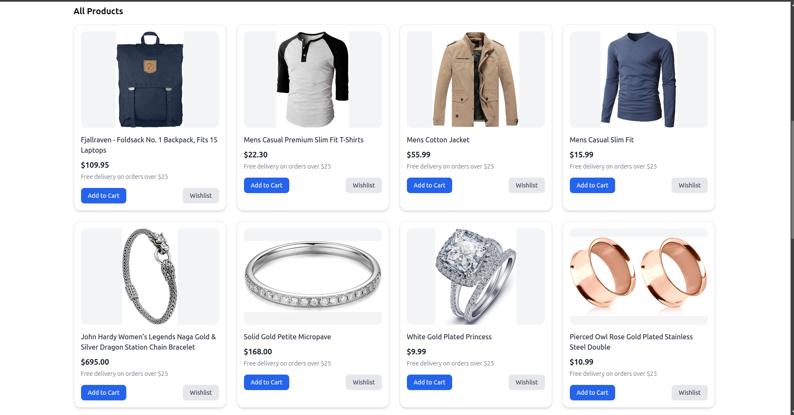
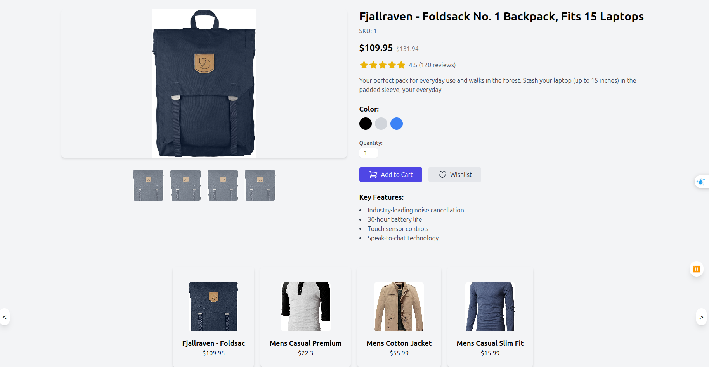

# E-Commerce Application





This project is a simple React-based e-commerce application that provides users with an interactive interface for browsing products, viewing product details, and user authentication via login and signup pages. It is designed using modern practices like React Router for navigation and clean, reusable component structures.

---

## Features

- **Home Page**: Displays a list of products with a user-friendly layout.
- **Product Details**: Provides detailed information about individual products.
- **User Authentication**:
    - Login page for existing users.
    - Signup page for new users.
- **Responsive Design**: Optimized for a great user experience across devices.

---

## File Structure

The project is structured as follows:

```bash
── App.css
├── App.js
├── App.test.js
├── components
│   ├── Carousel.jsx
│   ├── Navbar.jsx
│   └── ProductCard.jsx
├── features
│   └── category
│       └── CategoryFilter.jsx
├── index.css
├── index.js
├── logo.svg
├── pages
│   ├── HomePage.jsx
│   ├── Login.jsx
│   ├── ProductDetails.jsx
│   └── Signup.jsx
├── reportWebVitals.js
├── services
│   └── api.js
├── setupTests.js
└── store
    ├── slices
    │   ├── authSlice.js
    │   ├── categorySlice.js
    │   └── productSlice.js
    └── store.js

```

---

## How to Run the Project

### Prerequisites

Ensure you have the following installed:

- **Node.js** (version 20 or above)
- **npm** or **yarn**

### Steps

1. Clone the repository:
    
 
    
    ``` bash 
    git clone https://github.com/MohamedHamed12/front-end-e-commerce.git
    ```
    
2. Install dependencies:
    
   
    ``` bash
    npm install # or yarn install
    ```
    
3. Start the development server:
    
    
    ``` bash
    npm start # or yarn start
    ```
    
4. Open your browser and navigate to:
    
    
    ```
     http://localhost:3000/
     ```

---

## Routes

The application supports the following routes:

- **/**: Home page.
- **/product/:productId**: Product details page.
- **/login**: Login page.
- **/signup**: Signup page.

---

## Key Technologies

- **React**: Frontend library for building user interfaces.
- **React Router**: Handles navigation and routing between pages.
- **CSS/Tailwind CSS**: Used for styling the components.

---

## Future Improvements

- Add a shopping cart feature.
- Implement user authentication with a backend service.
- Add unit tests for components and pages.
- Enhance product filtering and sorting functionality.
- Integrate a database or API for dynamic data.

---

## Contributing

Contributions are welcome! Please follow these steps:

1. Fork the repository.
2. Create a new branch (`git checkout -b feature-name`).
3. Commit your changes (`git commit -m "Add a new feature"`).
4. Push the branch (`git push origin feature-name`).
5. Create a pull request.

---

## License

This project is open-source and available under the MIT License.

---

## Contact

For any questions or feedback, feel free to reach out at:

